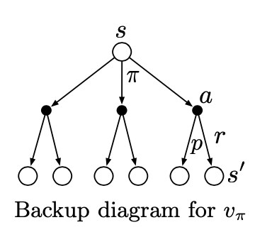

# Finite Markov Decision Processes \(MDPs\)

## Model

### Notations

| Notation | Definition |
| :--- | :--- |
| $$t$$ | Timestamp |
| $$\mathcal{S}$$ | Set of all states |
| $$S_t$$ | Random variable state at timestamp $$t$$ |
| $$\mathcal{A}(s)$$ | Set of all actions at state s |
| $$A_t$$ | Random variable action at timestamp $$t$$ |
| $$\mathcal{R}$$ | Set of all rewards |
| $$R_t$$ | Random variable reward at timestamp $$t$$ |

Note that $$\mathcal{S},\mathcal{A}(s),\mathcal{R}$$ are finite

### Illustration

### Dynamics of MDP

$$ p(s',r|s,a) = Pr\{S_t = s', R = r | S_{t-1}=s, A_{t-1}=a\}$$

#### Property

$$ \sum_{s' \in \mathcal{S}, r \in \mathcal{R}}p(s',r|s,a) = 1$$

### State transition

$$p(s'|s,a) = Pr\{S_t=s'|S_{t-1}=s,A_{t-1}=a\} = \sum_{r \in \mathcal{R}}p(s',r|s,a)$$

### Expected reward

#### state - action pair

$$ r(s,a) = \mathbb{E}[R_t|S_{t-1}=s,A_{t-1}=a] = \sum_{s' \in \mathcal{S}, r \in \mathcal{R}}r\cdot p(s',r|s,a)$$

#### state - action - next-state triple

$$ r(s',s,a) = \sum_{r \in \mathcal{R}} r \frac{p(r,s'|s,a)}{p(s'|s,a)}$$

## Goals and Rewards

Maximise total accumulative rewards in a given long period or until the game ends.

Warning: **not** maximising immediate reward

The reward signal is to tell the agent **what to achieve**, but **not how to achieve it**.

Counter example: if giving rewards if the agent takes the opponent's piece in a chess game, the agent will work towards taking pieces instead of wining the game.

## Returns and Episodes

### Notations and definitions

| Notation | Definition |
| :--- | :--- |
| $$G_t$$ | Return at time stamp $$t$$ |
| $$T$$ | The time of termination |

Episode: an agent environment interaction subsequence which ends in a terminal state.

Episodic tasks: agent-environment interaction can break into episodes

Continuing tasks: agent-environment interaction goes continually without limit, or $$T=\infty$$

#### Return

Discounted return

$$G_t = \sum_{k=t+1}^{T}\gamma ^ {k-t-1} R_k$$

where $$0 \le \gamma \le 1 $$

Note: when $$\gamma = 1$$ and $$T$$ is finite, it the simple return

### Properties

$$G_t = R_{t+1} + \gamma G_{t+1}$$

## Policies and Value Functions

### Notations and definitions

| Notation | Definition |
| :--- | :--- |
| $$\pi$$ | Policy |
| $$v_{\pi}(s)$$ | State-value function for policy $$\pi$$ |
| $$q_{\pi}(s,a)$$ | Action-value function for policy $$\pi$$ |

Policy: a mapping from states to probabilities of selecting each possible action

$$v_{\pi}(s) = \mathbb{E}_{\pi}[G_t|S_t=s]$$ 

Expected return when starting in $$s$$ and following $$\pi$$ thereafter

$$q_{\pi}(s,a) = \mathbb{E}_{\pi}[G_t|S_t=s,A_t=a]$$

Expected return when starting in $$s$$ , taking the action $$a$$ , and following $$\pi$$ thereafter

Notes

1. Value of any terminal state is zero (since $$R_k = 0$$ for $$k \ge T+1$$ )
2. Value functions are time-invariant

### Bellman equation

$$v_{\pi}(s) = \sum_{a}\pi(a|s) \sum_{s',r}p(s',r|s,a)[r+\gamma v_\pi(s')]$$

Note: Summation of probability $$\times$$ reward along all possible state transition paths

## Optimal Policies and Optimal Value Functions

Let $$v_*(s)$$ , $$q_*(s,a)$$ be the state-value, action-value function for optimal policy $$\pi_*$$ respectively

$$\begin{align*}  v_*(s) & = \underset{a \in \mathcal{A}(s)}{\max}q_*(s,a) \\ &=  \underset{a }{\max} \sum_{s',r}p(s',r|s,a)[r+\gamma v_*(s')] \end{align*}$$

$$q_*(s,a) = \sum_{s',r} p(s',r|s,a)[r + \gamma \underset{a' \in \mathcal{A}(s')}{\max}q_*(s',a') ]$$

## Problems

1. The model requires well-defined transition probabilities \(aka the environment's dynamics\), which are not always available.
2. The design of rewards is not so trivial.

### Solutions

#### Problem 1

Monte Carlo method and its descendants.

## References

1. R. S. Sutton and A. G. Barto, Reinforcement learning: An introduction. MIT press, 2018. [Link](https://mitpress.mit.edu/books/reinforcement-learning-second-edition)

